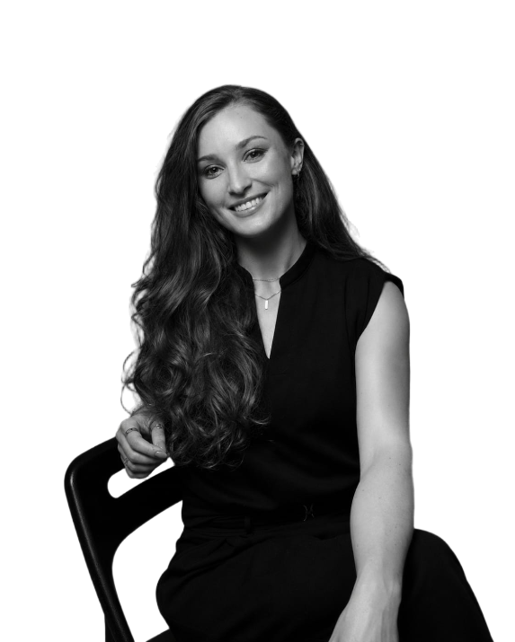

# AGENTS.md

Guidance for any AI/coding agent editing this repository.

This is a static, dependency-free site (plain HTML/CSS/JS, no build step) served
via GitHub Pages at https://niavicta.com. `main` is the live branch: whatever
lands on `main` deploys. Work on a branch and open a PR unless told otherwise.

## Images — always use the image bank

When a page or blog post needs a photo or diagram:

1. Read `dirs/img/image-bank.json` and pick the image whose `description` and
   `tags` best match the content. Respect `use` (hero / inline / thumbnail) and
   `orientation`.
2. Insert it with the site's standard `` markup,
   using the catalogued `alt` text. Full snippets and the hero-figure pattern
   are in `dirs/img/README.md`.
3. If nothing fits, say the piece needs a new image and describe it. Do not
   force a weak match.

To add a new image: drop it in `dirs/img/`, run `python build-image-bank.py`,
then fill in the new entry's `description`, `tags`, `use`, and `alt`.

## Publishing or editing a blog post — check sync before you push

**The vault draft is the source of truth for the words.** Chani edits the
markdown draft in the brain vault (`content/blog/*.md`); the page here is a
separate hand-published HTML file. Nothing syncs them automatically, so an edit
in the vault can silently fail to reach the live page. This has happened.

Before pushing any change to a post, run:

```bash
python check-post-sync.py
```

It pairs each vault draft to its page via the draft's `website-path:`
frontmatter field, compares the `## Draft` body against the page's
`<div class="prose article">` paragraphs, and exits non-zero on any drift,
naming the paragraph and showing where the wording diverges.

- **Exit 0** — every published post matches its draft. Safe to push.
- **Exit 1** — reconcile first. Take the vault draft's wording as correct unless
  Chani says otherwise, update the HTML, and re-run until it passes.

When you publish a new post, set `website-path:` (and `canonical-url:`) in the
draft's frontmatter, or the checker cannot see the post and will skip it.

## Blog post layout — author avatar and image styling

Every blog post's hero carries a large circular black-and-white portrait of
its author in the right-hand grid column, next to the title, from
`dirs/img/team/` (`chani-bw.png` for Chani Galgut, `jasmine-bw.png` for
Jasmine Beukema). The pattern, as the second child of the page-hero's
`.inner.grid`:

```html
<div class="hero-portrait" data-reveal>
  
</div>
```

Post images stay inside the reading column: the hero uses
`<figure class="article-hero">`, inline images inherit the `.prose.article img`
rule, and `.prose.article` is centered with `margin:0 auto`. Copy the `<style>`
block from `you-dont-lose-your-work-to-ai.html` (the reference post) when
creating a new post. Never full-bleed an image beside the 720px text column.

## Content voice

Brand copy follows the Niavicta voice rules: no em dashes, affirmative framing,
short paragraphs, plain English, active voice. Blog posts carry the standard
site chrome (header, footer, SEO block, structured data). See
`follow-the-journey.html` and any post under it for the pattern.

## After changing pages

Keep `sitemap.xml` and `llms.txt` in sync when you add or remove a page.
